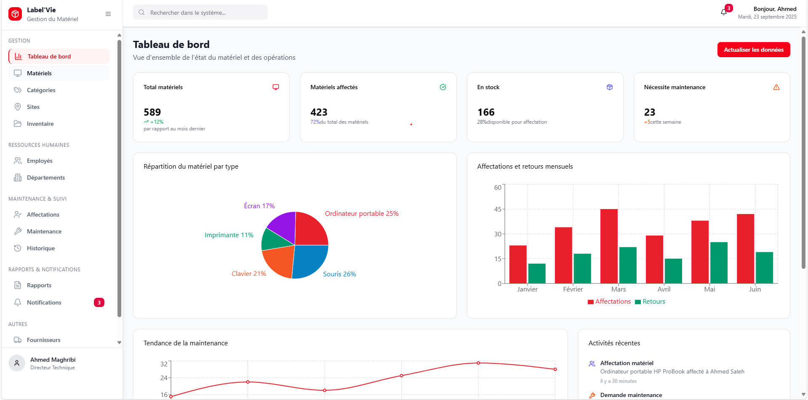
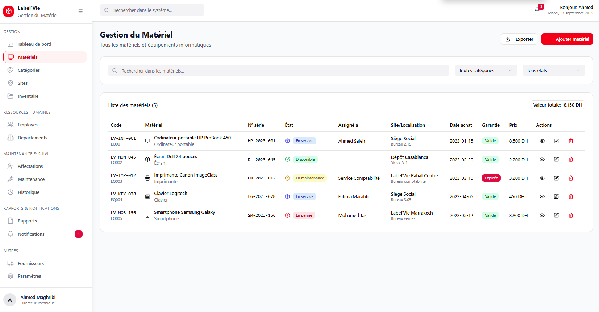
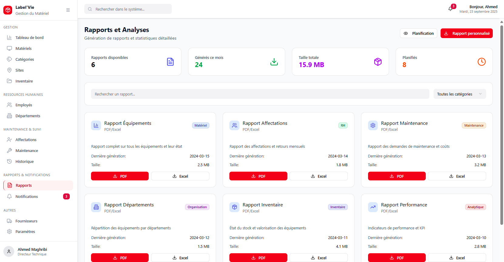
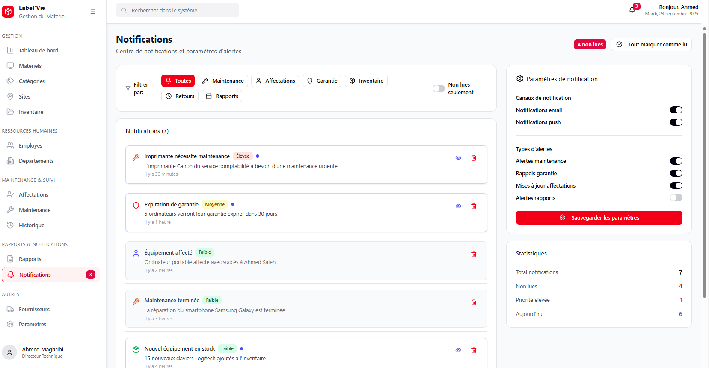

# 💻 Système de Gestion du Matériel

Application web pour gérer le matériel informatique dans une organisation : catégories, affectations, maintenance, sites, départements...

---

## 🛠️ Technologies utilisées

- ⚛️ React + TypeScript
- ⚡ Vite
- 🎨 CSS Modules
- 🔗 Git + GitHub

---

 
## Aperçu de l'application







## 🚀 Démarrer le projet en local

```bash
npm install
npm run dev
